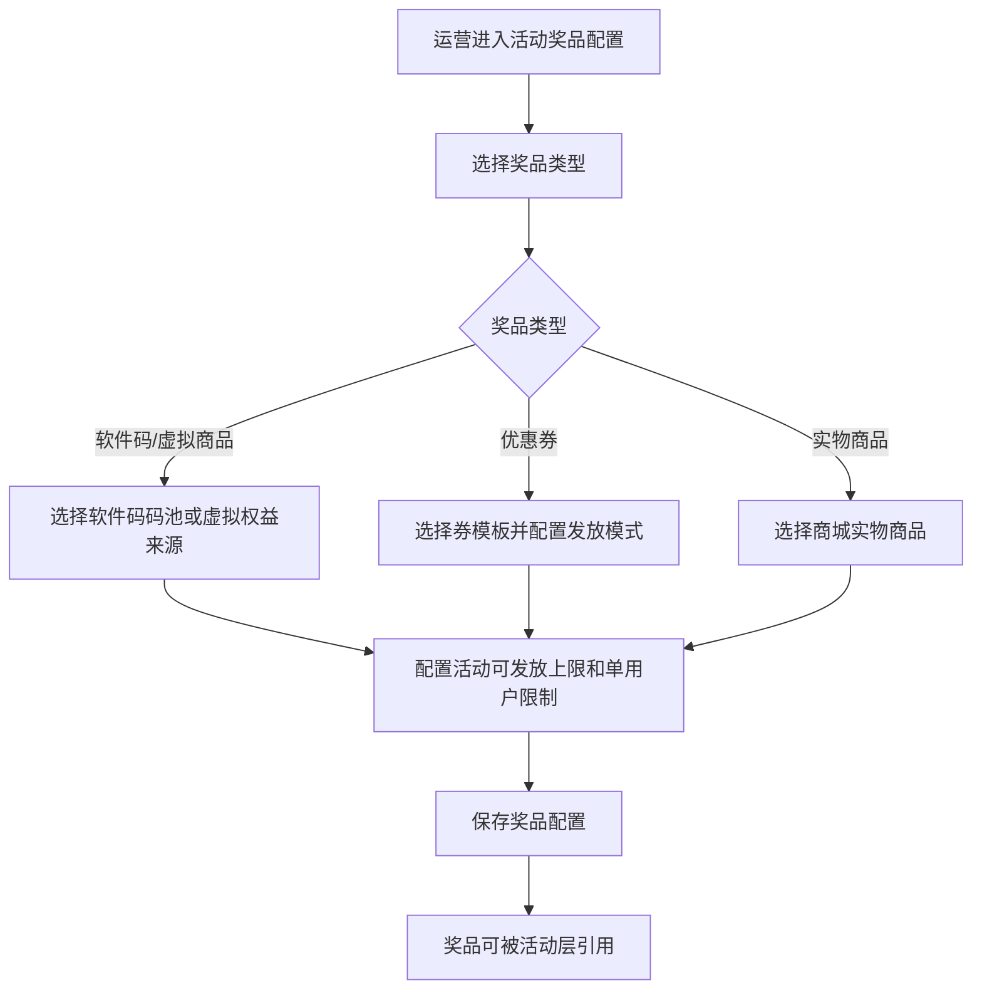
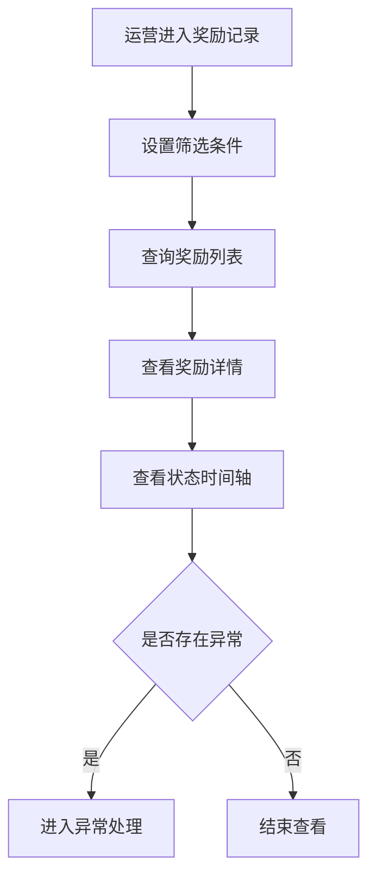
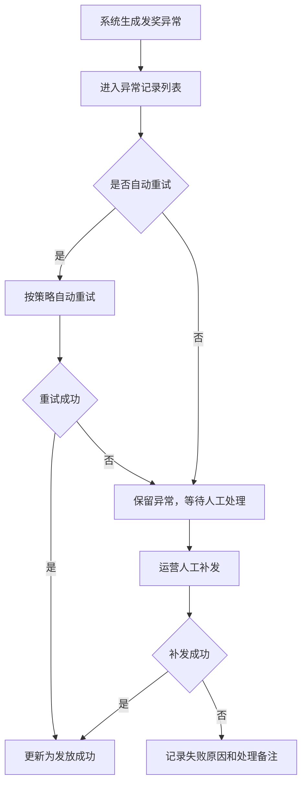
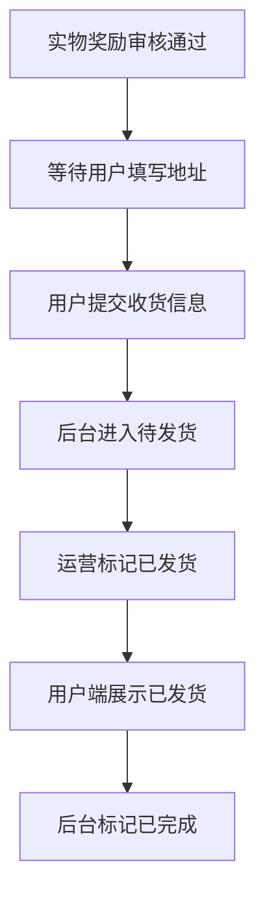

# 社区活动奖品层：运营后台配置流程

日期：2026-06-16

## 1. 后台模块

运营后台建议包含以下模块：

- 活动奖品配置。
- 用户奖励记录。
- 审核结果查看。
- 发奖异常处理。
- 实物履约管理。

活动玩法、审核/风控规则、奖励入口配置归活动层管理。奖品层后台主要负责奖品配置、发放执行结果、异常处理和履约状态。

## 2. 活动奖品配置流程

配置字段：

- 奖品类型。
- 奖品来源。
- 展示名称。
- 展示图片。
- 奖品说明。
- 活动可发放上限。
- 单用户限制。
- 是否启用。
- 优惠券发放模式。
- 是否需要审核，展示活动层规则结果。

校验规则：

- 奖品来源必选。
- 活动可发放上限必须大于 0。
- 活动可发放上限不能超过来源可用库存。
- 优惠券奖品必须选择发放模式。
- 来源对象不可用时不允许保存。

## 3. 奖励记录查询流程

筛选条件：

- 活动名称/活动 ID。
- 用户 ID/手机号。
- 奖品类型。
- 奖品名称。
- 审核状态。
- 发放状态。
- 发放失败原因。
- 创建时间。

列表字段：

- 奖励编号。
- 活动信息。
- 用户信息。
- 奖品名称。
- 奖品类型。
- 审核状态。
- 发放状态。
- 库存占用状态。
- 创建时间。
- 操作。

## 4. 发奖异常处理流程

异常记录字段：

- 奖励编号。
- 活动信息。
- 用户信息。
- 奖品类型。
- 失败环节。
- 失败原因。
- 重试次数。
- 最后重试时间。
- 处理状态。
- 操作记录。

人工补发规则：

- 必须有补发权限。
- 必须填写处理备注。
- 默认补发原奖品。
- 是否允许替换奖品待细化。
- 已发放成功的奖励不允许重复补发同一权益。

## 5. 实物履约流程

履约列表字段：

- 奖励编号。
- 活动名称。
- 用户信息。
- 商品名称。
- 商品规格。
- 收货人。
- 手机号。
- 地址。
- 审核状态。
- 发货状态。
- 操作。

V1 不包含：

- 成本。
- 供应商。
- 物流单号。
- 导出发货。
- 退换货。

## 6. 活动结束处理

共享库存下，活动结束后只关闭该活动的领取或发奖入口。

处理规则：

- 未生成奖励记录的奖品不需要清退。
- 未占用库存的奖品仍在共享库存中。
- 已生成奖励记录继续走审核、发放或履约。
- 审核拒绝、审核超时、取消发放时释放已占用库存。
- 后台保留活动奖品配置快照。
