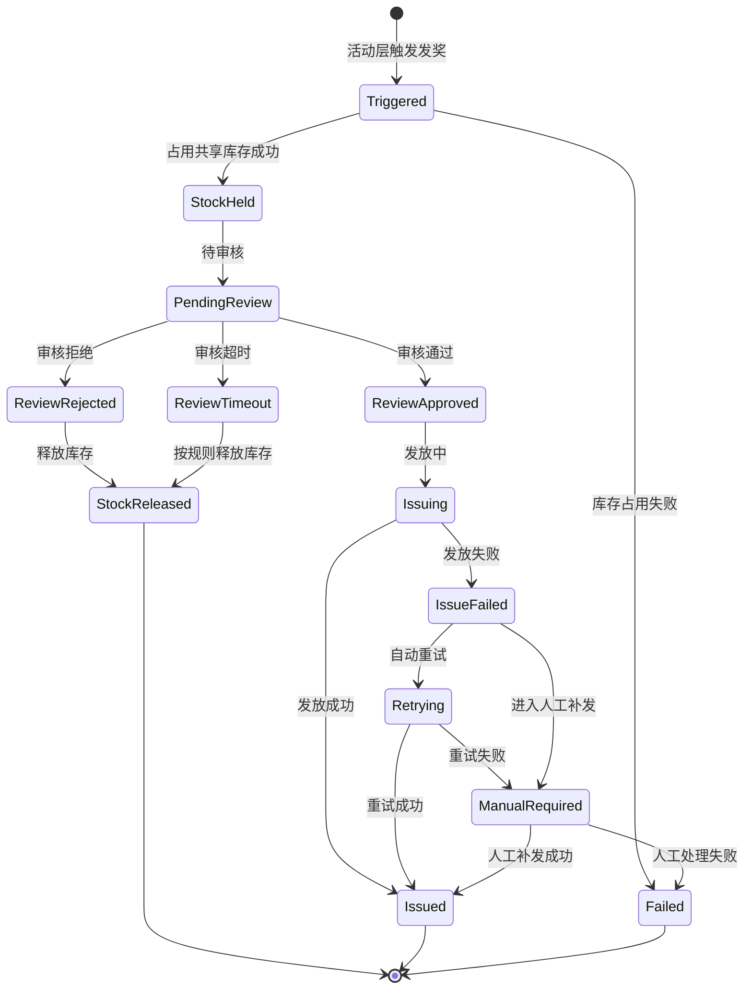
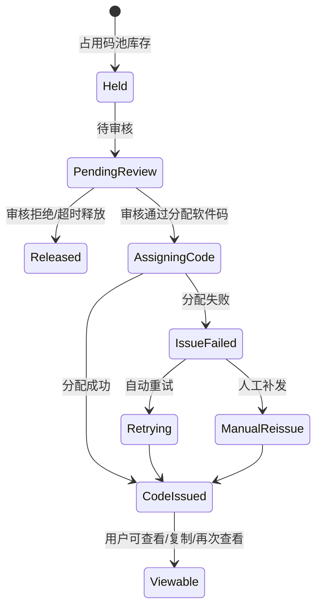
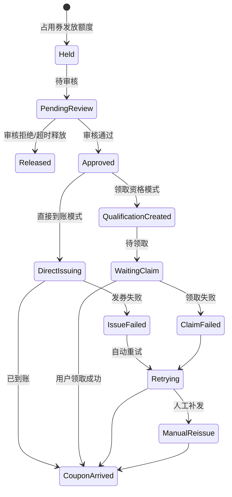
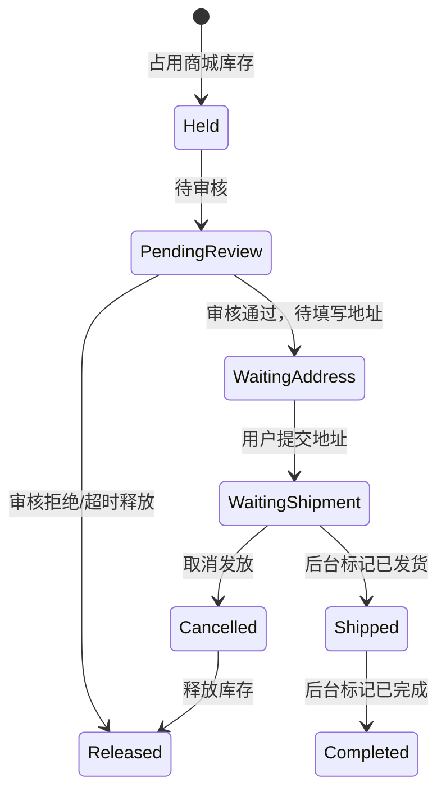

# 社区活动奖品层：奖品与发放状态流转图

日期：2026-06-16

## 1. 奖励主状态流转

## 2. 软件码状态流转

## 3. 优惠券状态流转

## 4. 实物商品状态流转

## 5. 状态说明表

| 状态 | 含义 | 用户端是否展示 | 后台是否展示 |
| --- | --- | --- | --- |
| 待审核 | 已占用库存，等待活动层审核/风控结果 | 展示审核中或按活动规则展示 | 展示 |
| 审核拒绝 | 活动层判定不可发放 | 由活动层决定展示 | 展示 |
| 发放中 | 审核通过，系统正在发放权益 | 可展示待发放 | 展示 |
| 发放失败 | 技术性发放失败 | 不直接展示技术失败 | 展示 |
| 自动重试中 | 系统按策略重试发放 | 不展示 | 展示 |
| 待人工补发 | 自动重试未解决或需人工处理 | 不展示技术原因 | 展示 |
| 已到账 | 优惠券或虚拟权益已到账 | 展示 | 展示 |
| 待领取 | 用户有领取资格但未领取 | 展示 | 展示 |
| 待填写地址 | 实物奖品需要用户填写地址 | 展示 | 展示 |
| 待发货 | 用户已填写地址，等待后台发货 | 展示 | 展示 |
| 已发货 | 后台已标记发货 | 展示 | 展示 |
| 已完成 | 奖励流程完成 | 展示 | 展示 |
