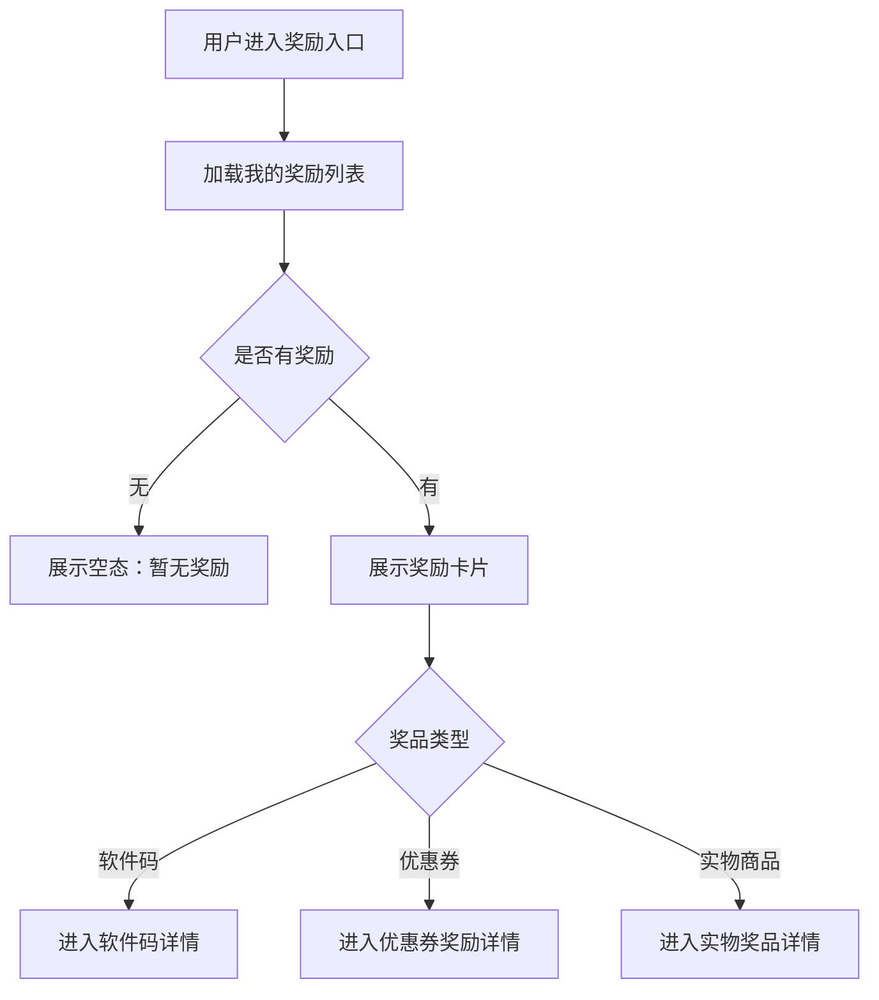
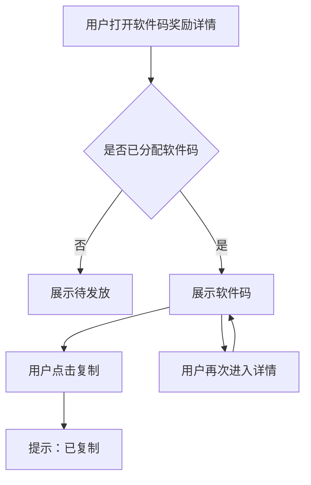
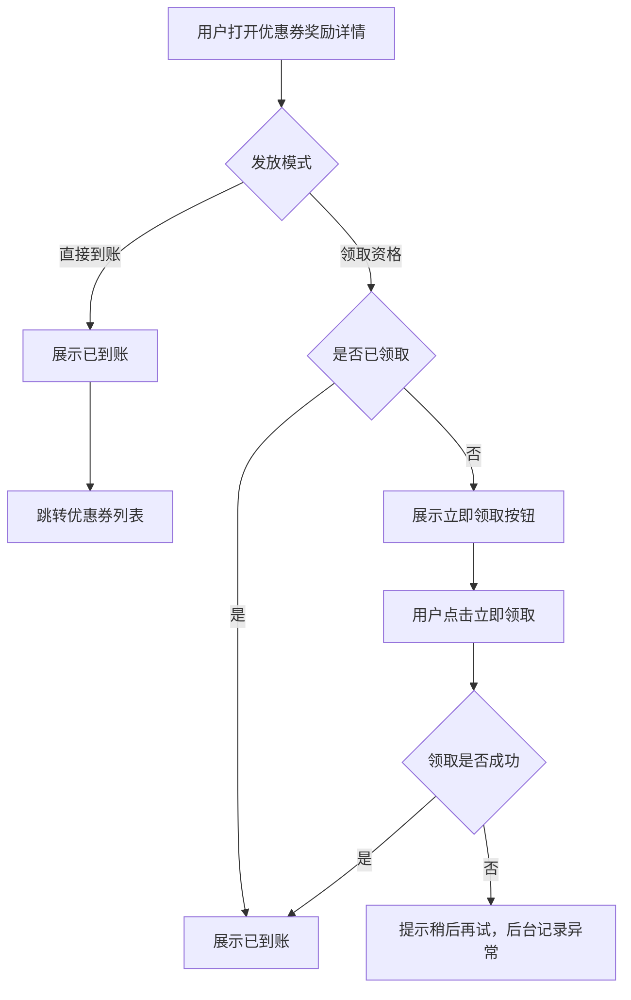
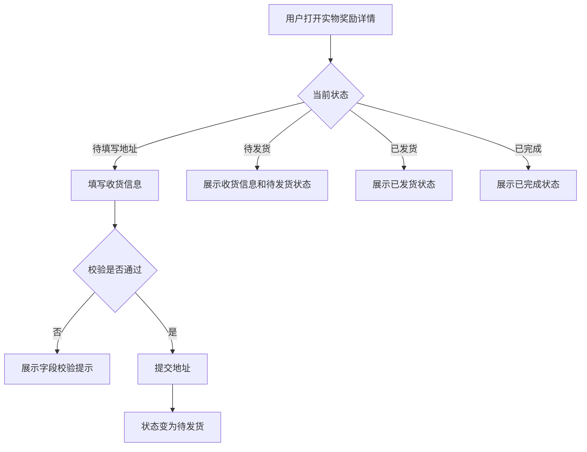

# 社区活动奖品层：用户端页面流程

日期：2026-06-16

## 1. 用户端入口

奖励入口由活动层配置，可能出现在：

- 活动页：用户完成活动后，在活动页查看奖励结果或奖励入口。
- 个人中心：用户查看“我的奖励”。
- 社区消息：系统消息通知用户获得奖励、待领取、待填写地址。
- 积分商城记录：复用原有权益记录或兑换记录入口展示活动奖励。

奖品层不决定入口位置，只需要向活动层和用户端提供奖励记录、奖品类型、业务状态和可操作动作。

## 2. 通用奖励列表流程

奖励卡片建议展示：

- 奖品名称。
- 奖品图片。
- 奖品类型。
- 来源活动。
- 获得时间。
- 业务状态：审核中、待发放、待领取、已到账、待填写地址、待发货、已发货、已完成、审核未通过。
- 主操作按钮：查看、复制、立即领取、填写地址、查看详情。

## 3. 软件码用户流程

页面规则：

- 软件码允许查看、复制、再次查看。
- 软件码属于单码单用，用户端不展示码池库存。
- 非本人访问时不展示软件码内容。

异常处理：

- 软件码未发放：展示“待发放”，不展示技术失败原因。
- 复制失败：提示“复制失败，请手动选择复制”。

## 4. 优惠券用户流程

页面规则：

- 直接到账模式下，用户不需要点击领取。
- 领取资格模式下，用户需要主动领取。
- 用户端不展示“发券接口失败”等技术文案。

异常处理：

- 券模板失效或发放失败：后台进入异常队列，用户端展示待发放或稍后再试。
- 重复领取：提示“已领取，请勿重复操作”。

## 5. 实物商品用户流程

收货信息字段：

- 收货人。
- 手机号。
- 地区。
- 详细地址。

页面规则：

- 已发货后不允许用户自行修改地址。
- 当前 V1 不要求展示物流单号。
- 如需修改已发货地址，提示联系运营或客服处理。

## 6. 用户端状态展示建议

| 状态 | 用户端展示 | 用户可操作 |
| --- | --- | --- |
| 审核中 | 审核中 | 查看详情 |
| 审核未通过 | 未获得奖励或审核未通过，按活动规则展示 | 查看原因或返回活动页，具体由活动层决定 |
| 待发放 | 待发放 | 查看详情 |
| 待领取 | 待领取 | 立即领取 |
| 已到账 | 已到账 | 查看优惠券或查看详情 |
| 待填写地址 | 待填写地址 | 填写地址 |
| 待发货 | 待发货 | 查看收货信息 |
| 已发货 | 已发货 | 查看详情 |
| 已完成 | 已完成 | 查看详情 |

## 7. 用户端不展示内容

- 不展示技术性发奖失败原因。
- 不展示后台自动重试次数。
- 不展示共享库存数量。
- 不展示人工补发内部备注。
